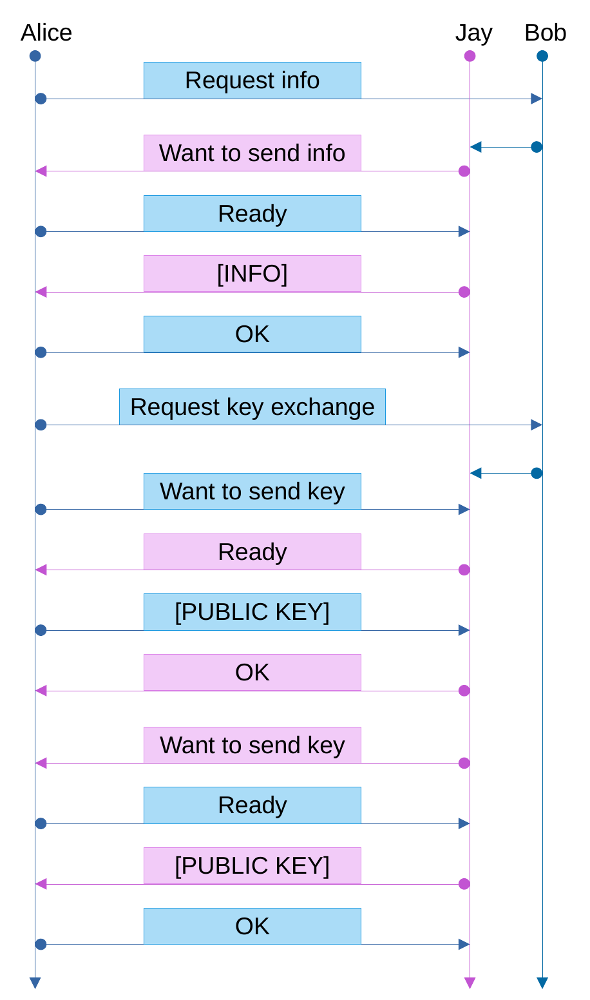
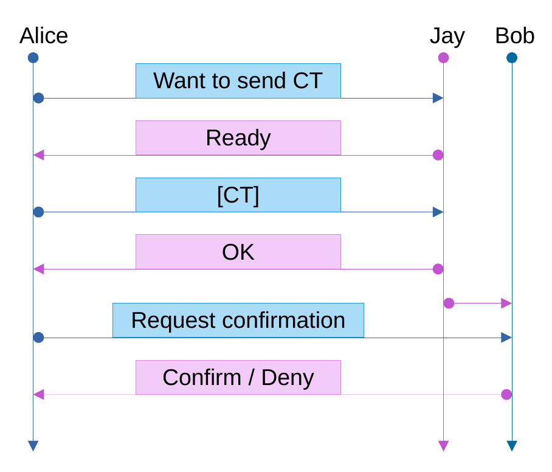
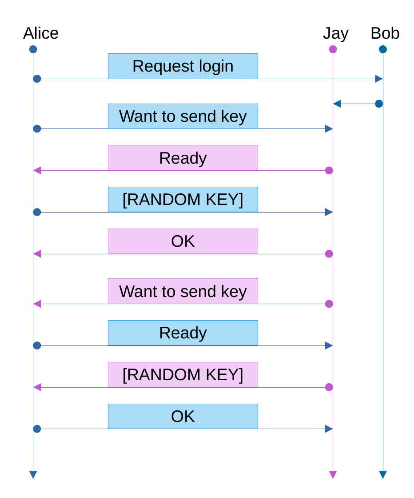

# Protocol Documentation
The protocol uses Elliptic Curve Diffie-Hellman (ECDH) key exchange, HMAC-based extract-and-expand key derivate (HKDF) and SHA-1 + SHA-256 cryptographic hash functions and AES block cipher with CBC-MAC (AES-CCM) for encryption/decryption.

## Registration

1. Alice generates a ECDH key pair using SECP256R1 curve

1. Alice (client) exchanges keys with the Bob/Jay (server)


1. Alice generates the ciphertext (simplified)
```
did, token, bind = HKDF(ECDH(jay_public_key, alice_private_key))
ct = AESCCM(alice_key, did, jay_remote_info)
```
The token has to be saved for later usage!

1. Alice sends the ciphertext to Jay and Bob responds


## Login

1. Alice generates a key (random bytes) and exchanges keys with Jay


2. Alice hashes the token twice, salting it with the keys (simplified)
```
salt = alice_random_key + jay_random_key
alice_key, jay_key, alice_iv, jay_iv = HKDF(token, salt)
info = HMAC(alice_key, salt)
```
Alls Keys and IV's need to be saved for later usage!

3. Alice sends the hashed token to Jay and Bob responds


## UART
If all above succeeds, Alice is given rights to access the UART service.

Using the keys generated in step 2 of the login Alice can now encode/decode UART message
1. Message encoding (simplified)
```
nonce = alice_iv + '0000' + message_counter
ct = AESCCM(alice_key, message, nonce)
```
2. Message decoding (simplified)
```
nonce = jay_iv + '0000' + message_counter
ct = AESCCM(jay_key, message, nonce)
```
